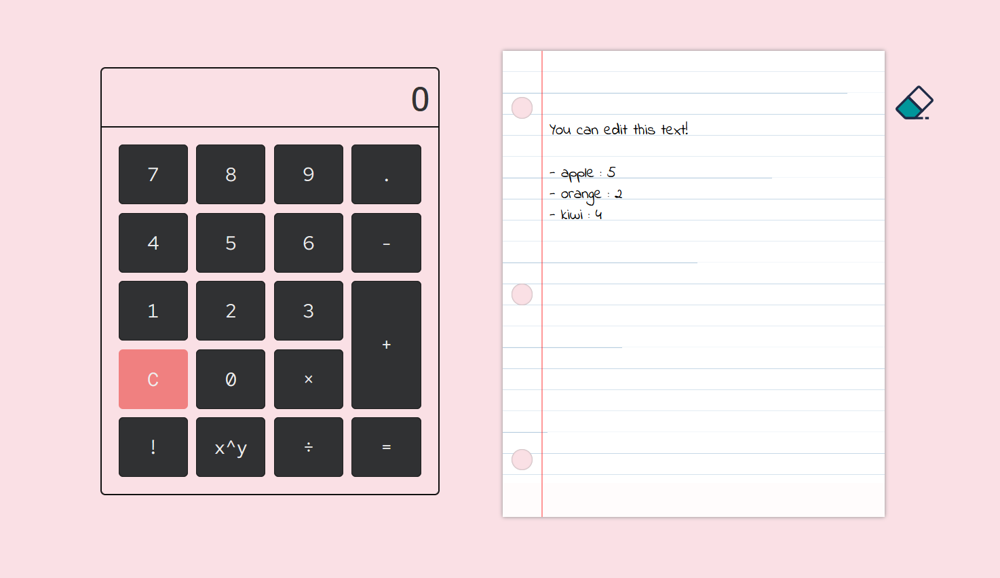

# Simple calculator and notepad

This project was created to practice vanilla js.

## Screenshot

## Credits
- [Javascript crash course by Brad Traversy](https://www.youtube.com/watch?v=hdI2bqOjy3c)
- [Css design for calculator](https://scotch.io/bar-talk/build-a-css-grid-calculator-solution-to-code-challenge-2)
- A notepad design on codepen that I can't find the link for T-T